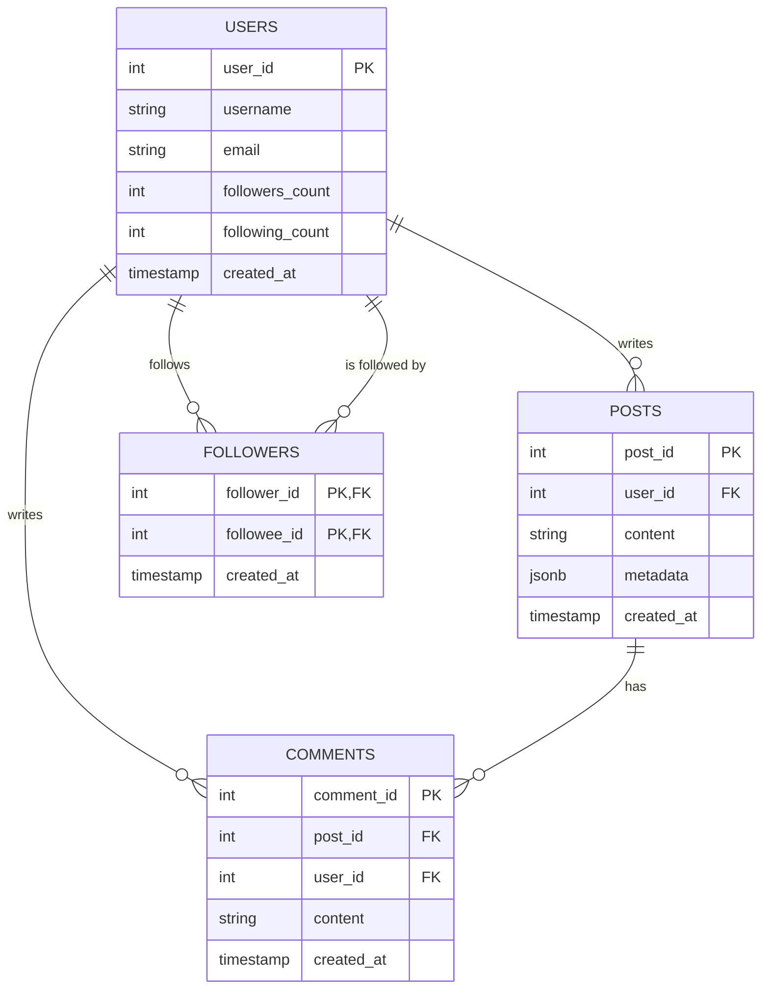

# ER Diagram

```mermaid
erDiagram
    USERS ||--o{ POSTS : writes
    USERS ||--o{ COMMENTS : writes
    POSTS ||--o{ COMMENTS : has
    USERS ||--o{ FOLLOWERS : follows
    USERS ||--o{ FOLLOWERS : "is followed by"

    USERS {
        int user_id PK
        string username
        string email
        int followers_count
        int following_count
        timestamp created_at
    }

    POSTS {
        int post_id PK
        int user_id FK
        string content
        jsonb metadata
        timestamp created_at
    }

    COMMENTS {
        int comment_id PK
        int post_id FK
        int user_id FK
        string content
        timestamp created_at
    }

    FOLLOWERS {
        int follower_id PK, FK
        int followee_id PK, FK
        timestamp created_at
    }
```
